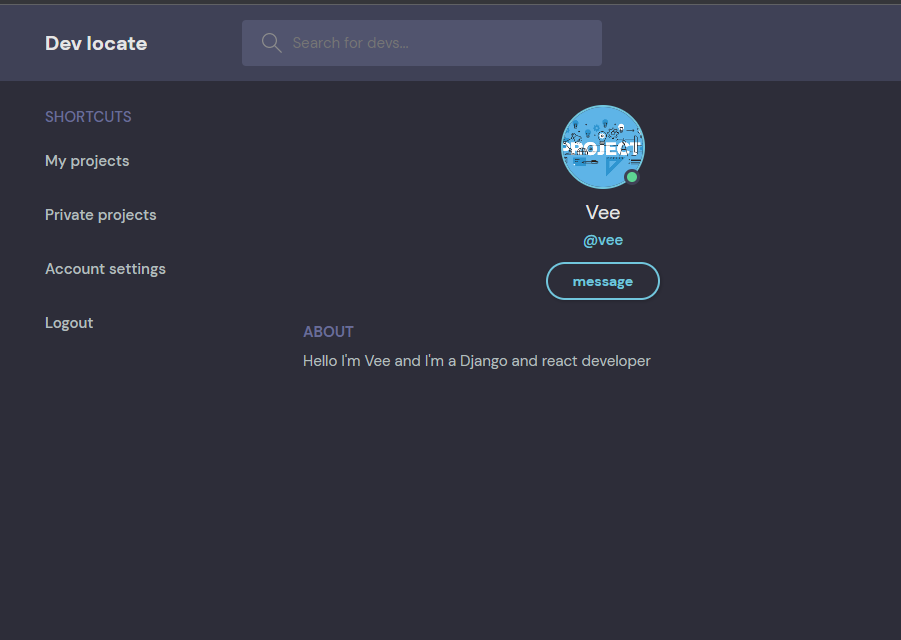
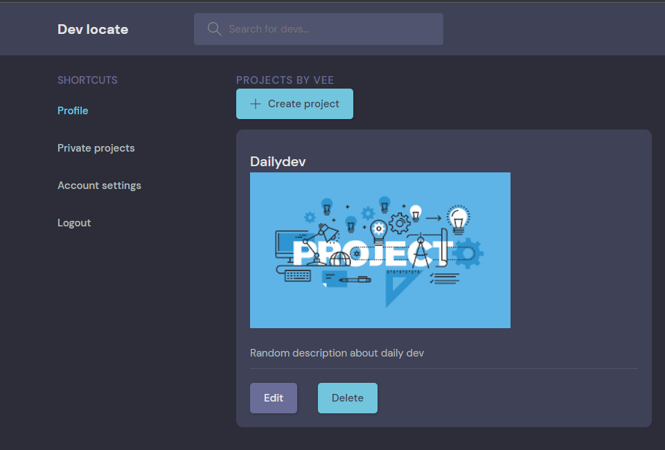
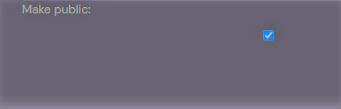
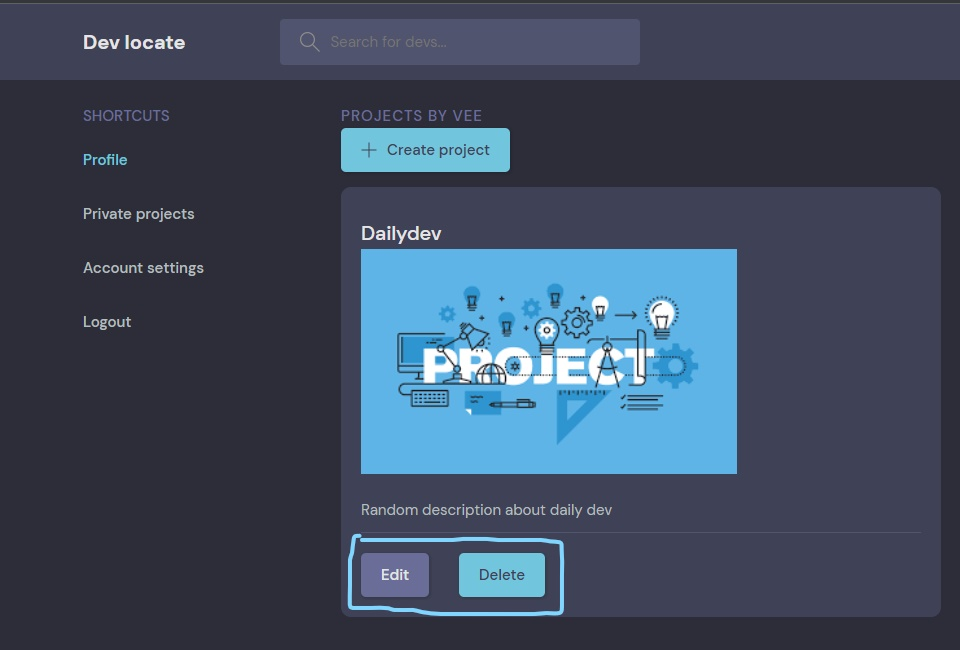
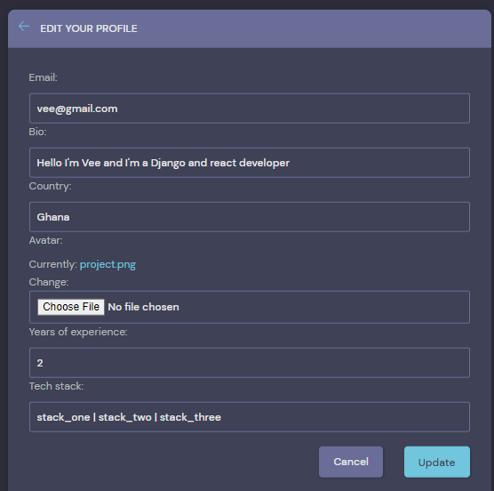
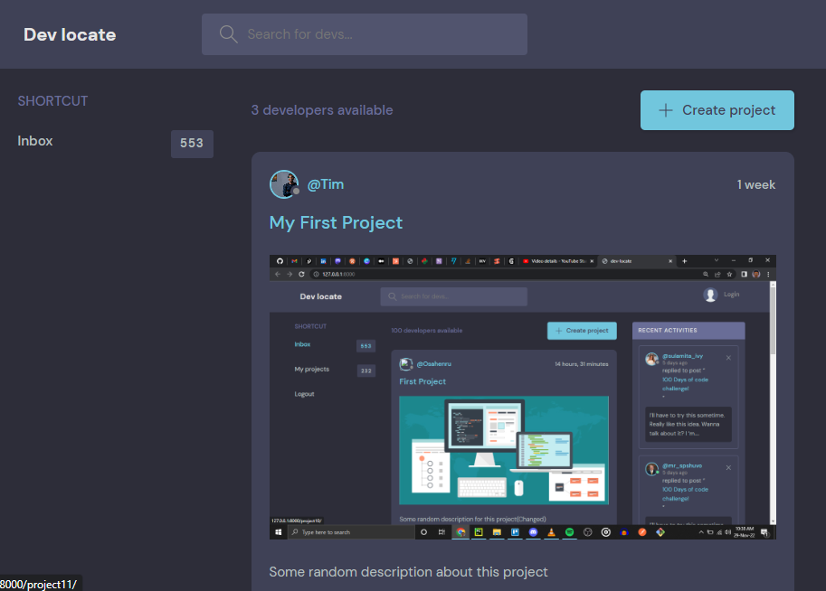
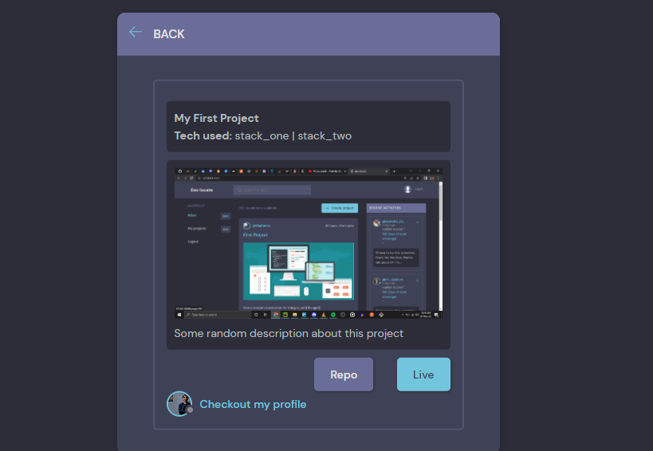
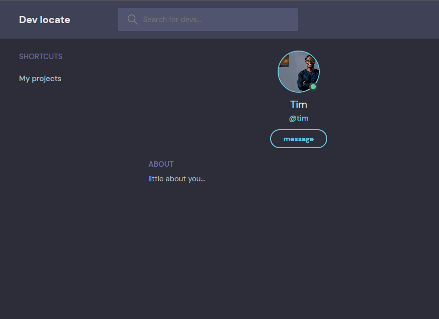

# Welcome to dev-locate
A platform where developers can sign up with their projects on display and hiring managers can make searches of developers based on location, year of experience, tech stack or any other search query.

# Basic setup
I assume the average user of this application has a fundamental understanding of the Python programming language,
has git running on their machine and has a desired editor (VScode or Pycharm)

if you do not have Python running on your machine you can check [here](https://www.digitalocean.com/community/tutorials/install-python-windows-10) to 
begin with how to run and setup Python on your machine.

to begin with how to run git on your machine check [here](https://phoenixnap.com/kb/how-to-install-git-windows) for a detailed instruction
I comfortably use [PyCharm](https://www.jetbrains.com/pycharm/download/#section=windows) but any editor with a commandline/ terminal will do for a beginner

## Cloning from GitHub
Once you have installed the above and have a ready environment clone this project to your machine by clicking on

click on the to copy this project

Now, we are going to make this project available on your machine with `git clone https://github.com/TimOsahenru/dev-locate.git`

VIOLA!!!

# Setting up a virtual environment
The following process describes how to set up a virtual environment before install the dependencies used for this projects
+ `python -m venv venv` to create a virtual environment
+ `venv\Scripts\activate` to activate the virtual environment

# Install requirements
+ Django. `pip install django` version 4.1 was used for this project

+ django-environ for environment variables `pip install django-environ`

+ `pip install Pillow`  which is a library for image processing.
+ `pip install black` for standard code formatting

Alternatively you can install all the dependencies from the `requirements.txt` file by running this command on your terminal

`pip install -r requirements.txt`

# Developer setup
+ Create a `.env` file inside your `config` repository, then create a variable called `SECRET_KEY` inside the `.env` file

+ Generate your secret key by running the command below on your terminal

`python -c 'from django.core.management.utils import get_random_secret_key; print(get_random_secret_key())'`

+ Copy the generated secret key and paste inside the `.env` file you created like this

`SECRET_KEY='Yourgeneratedsecretkeywithoutanyspace'`

# How to run the project
After installing the necessary dependencies next will be to finally run the project on your browser
to run this project on your on browser use the
`py manage.py runserver` to run the project locally on `port 8000`

# How to (Project tutorial)
## Using dev-locate as an Engineer
You need to SignUp as a User to be able to create a project but if you're in a haste to check out this application you can log in using `vee@gmail.com`

as your login email and `pycongh22` as your login password.

## Creating a project
To create a project you must be logged in, once you're logged in you'll be redirected to your profile.

To create your first project visit `My project` tab and click the `create` button

Once a project has been created you can choose to either make it public by checking `make public` or leave it private by not checking.

A private project is only visible to you(the requested user)

To edit a Project(public or private) visit the necessary tab and click on the edit button to make an update

Once a project has been deleted it cannot be recovered

To modify your profile settings click on `Account settings` tab and you should be able to do that from here

## Using dev-locate as a Hiring manager
As a hiring manager you do not need to create an account to signup you can make searches of developers
from the search bar by either searching by _country_, _tech stack_ or _username_

When you click on a project, you will be redirected to a more detailed page about the project, where you can
view the repo of the project or a live url

To contact an Engineer click on `Checkout my profile` in the detailed page you will be redirected

to the profile of the engineer that created that project and also click on the `message` button

you need to create an account tho to send a message

